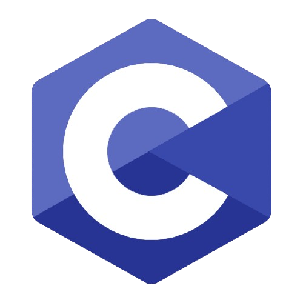

<!DOCTYPE html>
<html lang="en">
  <head>
    <meta charset="utf-8">
  </head>
  <body>
    <h1> Hey people, I am Devc,^_^</h1>
    <h2> This is my intro: Existence==Code,Sleep,Eat👍</h2>
    
These are some of the languages that I have worked with: 

    
    
  </body>

</html>

<!--
**Webdevc1/Webdevc1** is a ✨ _special_ ✨ repository because its `README.md` (this file) appears on your GitHub profile.

Here are some ideas to get you started:

- 🔭 I’m currently working on ...
- 🌱 I’m currently learning ...
- 👯 I’m looking to collaborate on ...
- 🤔 I’m looking for help with ...
- 💬 Ask me about ...
- 📫 How to reach me: ...
- 😄 Pronouns: ...
- ⚡ Fun fact: ...
-->
